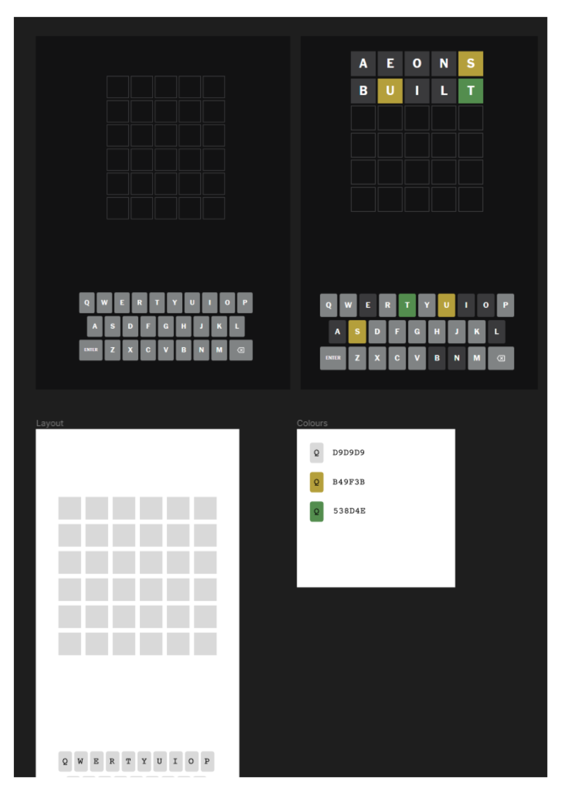

<a name="readme-top"></a>

<!-- PROJECT LOGO -->
<br />
<div align="center">
  <a href="https://github.com/procrastian/wordle_clone">
    
  </a>
<h3 align="center">Wordle Clone</h3>
  <p align="center">
    A clone of the Wordle app built using my knowledge of React and MUI.
    <br />
    <a href="https://github.com/procrastian/wordle_clone"><strong>Explore the docs »</strong></a>
    <br />
    <br />
    <a href="https://github.com/procrastian/wordle_clone">View Demo</a>
  </p>
</div>

<!-- TABLE OF CONTENTS -->
<details>
  <summary>Table of Contents</summary>
  <ol>
    <li>
      <a href="#about-the-project">About The Project</a>
      <ul>
        <li><a href="#built-with">Built With</a></li>
      </ul>
    </li>
    <li>
      <a href="#getting-started">Getting Started</a>
      <ul>
        <li><a href="#prerequisites">Prerequisites</a></li>
        <li><a href="#installation">Installation</a></li>
      </ul>
    </li>
    <li><a href="#usage">Usage</a></li>
    <li><a href="#roadmap">Roadmap</a></li>
    <li><a href="#contact">Contact</a></li>
  </ol>
</details>

<!-- ABOUT THE PROJECT -->

## About The Project

[![Product Name Screen Shot][product-screenshot]](https://example.com)

<p align="right">(<a href="#readme-top">back to top</a>)</p>

### Built With

- [![React][React.js]][React-url]
- [![JavaScript][JavaScript.js]][JavaScript-url]
- [![HTML5][HTML5.js]][HTML5-url]
- [![CSS3][CSS3.js]][CSS3-url]
- [![Nodejs][Nodejs.js]][Nodejs-url]
- [![MaterialUI][MaterialUI.js]][MaterialUI-url]

<p align="right">(<a href="#readme-top">back to top</a>)</p>

<!-- GETTING STARTED -->

## Getting Started

To get a local copy up and running follow these simple example steps.

### Prerequisites

This is an example of how to list things you need to use the software and how to install them.

- npm
  ```sh
  npm install npm@latest -g
  ```

### Installation

1. Clone the repo
   ```sh
   git clone https://github.com/procrastian/wordle_clone.git
   ```
2. Install NPM packages
   ```sh
   npm install
   ```

### Packages

- react-simple-keyboard
   <https://www.npmjs.com/package/react-simple-keyboard>
- MUI
- MUI Icons

<p align="right">(<a href="#readme-top">back to top</a>)</p>

<!-- USAGE EXAMPLES -->

## Usage

### Getting Started with Create React App

This project was bootstrapped with [Create React App](https://github.com/facebook/create-react-app).

#### Available Scripts

In the project directory, you can run:

##### `npm start`

Runs the app in the development mode.\
Open [http://localhost:3000](http://localhost:3000) to view it in your browser.

The page will reload when you make changes.\
You may also see any lint errors in the console.

Use this space to show useful examples of how a project can be used. Additional screenshots, code examples and demos work well in this space. You may also link to more resources.

_For more examples, please refer to the [Documentation](https://example.com)_

<p align="right">(<a href="#readme-top">back to top</a>)</p>

<!-- ROADMAP -->

## Roadmap

### Aims

- to have an app that allows a user to play the game `wordle` an unlimited amount of times
- have the app generate random 5 letter words each time it is played
- have the ability for the user to restart the game with a new word

### Plan

- have the app display to the user:
  - 5 letter spaces to guess in
  - if a given letter is in an incorrect position in the word
  - if a given letter is in the correct position in the word
  - if a given letter is not in the word
  - which letters have been guessed by the user



- nice to haves:
  - the ability for the user to select harder difficulty with fewer than 6 guesses
  - how to play pop-up explaining the game at the start
  - have the app recognise key strokes for letters
  - dark mode/light mode

### Progress

- [x] Implimenting a keyboard that the user can input guesses with
- [x] Keep track of any user submitted guesses using state
  - [ ] User able to submit a guess and check against target word
- [x] Display the grid for guessed letters
  - [ ] Show 6 total available guesses
- [ ] words API to generate target random 5 letter word (<https://www.wordsapi.com/docs/?javascript#random-words>?)
- [ ] Animation of letters when guess is made
- [ ] Colour coding for letter placements when guess made

See the [open issues](https://github.com/procrastian/wordle_clone/issues) for a full list of proposed features (and known issues).

<p align="right">(<a href="#readme-top">back to top</a>)</p>

<!-- CONTACT -->

## Contact

[![LinkedIn][linkedin-shield]][linkedin-url]
Ian Grantham - dev.iangrantham@gmail.com
Project Link: [https://github.com/procrastian/wordle_clone](https://github.com/procrastian/wordle_clone)

<p align="right">(<a href="#readme-top">back to top</a>)</p>

<!-- MARKDOWN LINKS & IMAGES -->

[linkedin-shield]: https://img.shields.io/badge/-LinkedIn-black.svg?style=for-the-badge&logo=linkedin&colorB=0A66C2
[linkedin-url]: https://linkedin.com/in/dev-ian-grantham
[React.js]: https://img.shields.io/badge/React-20232A?style=for-the-badge&logo=react&logoColor=61DAFB
[React-url]: https://reactjs.org/
[JavaScript.js]: https://img.shields.io/badge/JavaScript-20232A?style=for-the-badge&logo=javascript
[JavaScript-url]: https://www.javascript.com/
[HTML5.js]: https://img.shields.io/badge/HTML5-20232A?style=for-the-badge&logo=html5&logoColor=E34F26
[HTML5-url]: https://html.com/
[CSS3.js]: https://img.shields.io/badge/CSS3-20232A?style=for-the-badge&logo=css3&logoColor=1572B6
[CSS3-url]: https://developer.mozilla.org/en-US/docs/Web/CSS
[Nodejs.js]: https://img.shields.io/badge/node.js-20232A?style=for-the-badge&logo=nodedotjs&logoColor=339933
[Nodejs-url]: https://nodejs.org/en
[MaterialUI.js]: https://img.shields.io/badge/mui-20232A?style=for-the-badge&logo=mui&logoColor=007FFF
[MaterialUI-url]: https://mui.com/
